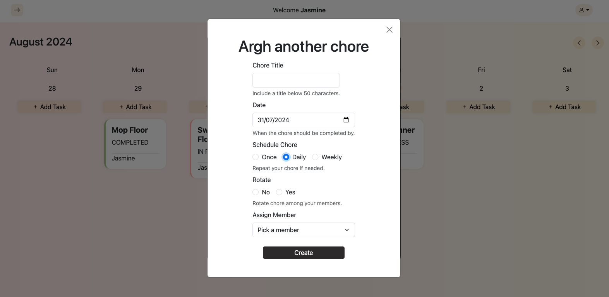

# Chores Tracker

A full PERN stack app designed for families, to schedule and manage household tasks. Think of it as a blend of Google Calendar's scheduling combined with Trello's collaborative tools.

<a href="http://3.0.146.49:5173/login" target="_blank">Live Preview</a>
Note that the app is deployed via AWS EC2 without any domain.

## Technology

- React.js
- TanStack Query
- PostgreSQL
- JWT
- Express.js
- Node.js
- Bootstrap
- Stripe Webhooks
- JavaScript
- CSS3
- HTML5
- AWS EC2 (deployment)

## Features

There are 2 versions - a freemium and a premium group account. For both types, users are able to create, edit, delete tasks and manage group members. However, for the premium version, users are able to create, edit and delete recurring tasks (set task to daily or weekly), as well as distribute a particular task evenly among the group members with a rotation function.

Here's a snippet of what's there in the app - 1. board, 2. members page, 3. subscription page, 4. user profile page, 5. register, login and logout.


Subscription page:


Stripe - click on the pro plan and user will be redirected to the stripe payment page. User group account will be updated in real time to pro plan once payment goes through. This is done through Stripe's webhook.


Register page:


Login page:


Board - where group members are able to view and keep track of everyone's tasks. Calendar can be scrolled infinitely. Calendar is done from scratch without any library.


Add chores (premium version):


Add chores (freemium version) - recurring and rotation function disabled.


View details - could see details of the assigned member, deadline, author, status and whether the task is set to one time, daily or weekly.


Edit chores (premium version) - likewise for the freemium version, user is only able to choose the 'this chore only' option.


Delete chores (premium version)


Members page - invite, cancel invitation and remove members.


User profile page


## Getting Started

Environment variables for backend

For raw PG:

```
USER
PASSWORD
HOST
PORT
DATABASE
```

For JWT:

```
ACCESS_SECRET
REFRESH_SECRET
```

For Stripe:

```
STRIPE_PRICE_ID
STRIPE_PAYMENT_LINK
STRIPE_PUBLISHABLE_KEY
STRIPE_SECRET_KEY
STRIPE_ENDPOINT_SECRET
SUCCESS_URL
CANCEL_URL
```

Environment variable for frontend

```
VITE_SERVER
```

## Next Steps

- User able to upload profile images.
- Gamification: Implement reward and penalty points for every chores completed or went overdue.
- Real-time notifications

## Project Planning

https://trello.com/invite/b/669d24adb7cac6f981dfa487/ATTIc0648991c8eab5bdd923852b497f910912C8024F/sei-project-4
